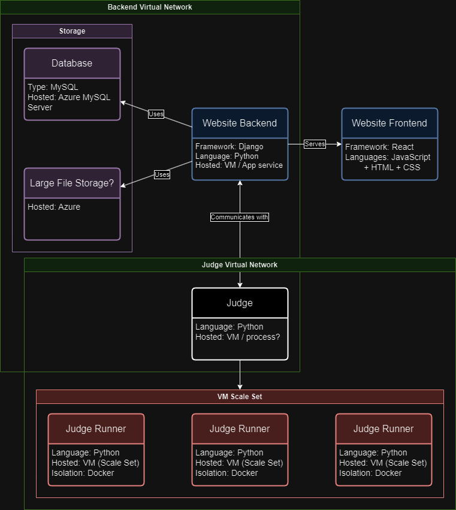
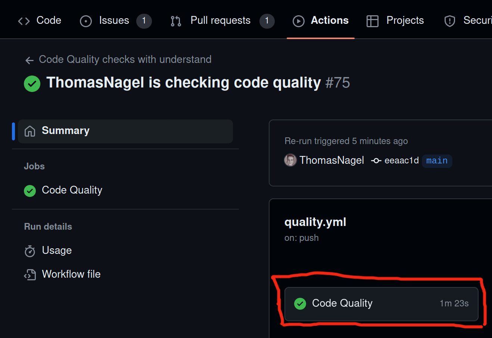
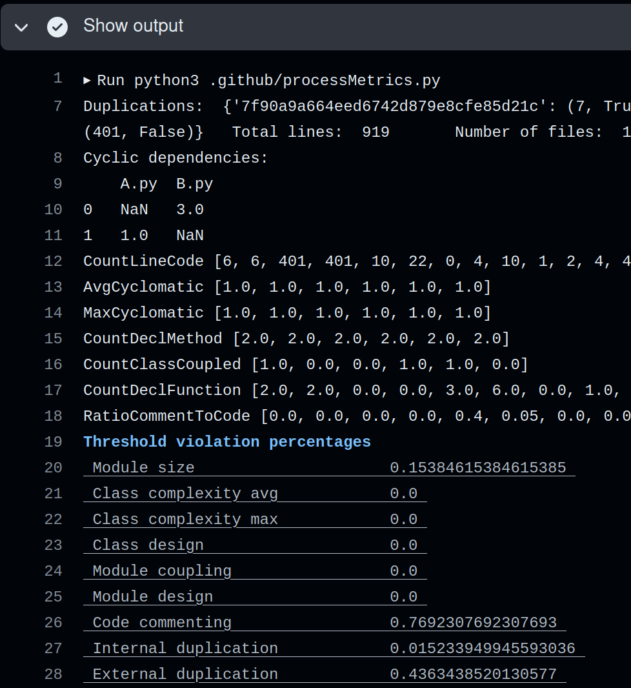

# Judge Runner

### Outdated diagram

# Code quality analysis

## What to do if checks fail?

Navigate to *show output* as shown below in the **Usage** section.
If *show output* in the workflow failed and it states **Code violations found!!!!!** at the bottom then you're code does not adhere to the quality standards. The table in the output above shows which categories have violations (in red). For a better understanding of quality standards you can look at the tables in the **Metrics** section.

For any questions about this workflow or issues contact Tom.

## Usage

This worklfow is run whenever a commit is pushed to main or a pr into main is made. It may take between 1 to 3 minutes to complete the analysis. To view the results do the following:

Navigate to the github action and click on the job *Code Quality*:\

The *Show output* tab shows all the metrics gathered by the tools:\

The output starts with some intermediate debug results, which you can ignore.
The evaluation of you code is shown in the tables below. *Threshold violation percentages* is the percentage of files/code that violate the metrics shown in the table below. *Ranks* shows the combined rank for each maintainability attribute. It shows the grade that our code would get according to the metrics that the TU/e uses.

## Metrics

For each characteristic we compute what percentage of the code is above the threshold. Then a rank is computed for that characteristic. For each Maintainability attribute we compute the average rank (based on its corresponding code characteristics).

Code characteristic         | Metric                               | Threshold | Maintainability attr.
----------------------------|--------------------------------------|-----------|----------------------
Module size                 | SLOC                                 |  <=400    | ADT
Class complexity            | Cyclomatic per method: average; max  |  <10; <20 | DT
Class design (for OO)       | WMC                                  |  <=20     | MRAD
Module design (for non OO)  | Functions per module/file            |  <=20     | MRAD
Module internal duplication | % of duplicated SLOC inside modules  |  N/A      | RAD
Code commenting             | % LOCM                               |  >15%     | A
Cyclic dependencies         | # of between classes                 |  0        | MRADT
Module coupling             | CBO                                  |  <16      | MR
Module external duplication | % of duplicated SLOC between modules |  N/A      | MR

rank    |    % of modules/classes/packages above threshold
--------|-------------------------------------------------
+2      |    0-3%
+1      |    4-5%
0       |    6-10%
-1      |    11-20%
-2      |    21–100%

Code | Maintainability attribute
-----|--------------------------
M    | Modularity
R    | Reusability
A    | Analyzability
D    | Modifiability
T    | Testability

The code quality assessment document that TU/e uses can be found [here](https://canvas.tue.nl/courses/25283/files/folder/SEP%20Materials/Assessment%20and%20Guidelines?).

## Code analysis tools
TU/e uses [simian](http://www.harukizaemon.com/simian/index.html/) to analyse code duplication.
[understand](http://scitools.com/student) is used to derive all the other metrics.

**Note:** understand incorrectly computes Module coupling, it only accounts for classes in the same file. 
